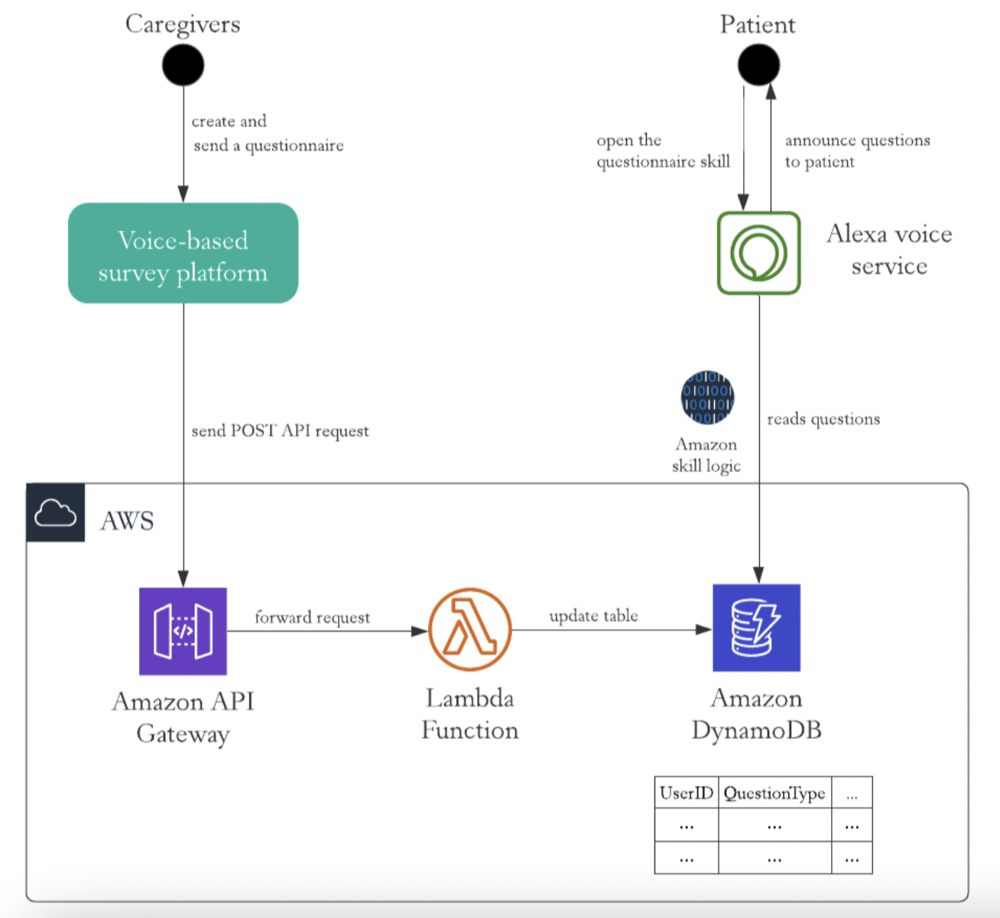

# Voice Qualtrics: platform for making voice-based questionnaires

Specialization project 2021, Yimeng Sun & Srishti Gupta

## Overview

Voice Qualtrics is a survey-making platform designed for creating and sending out questionnaires through Amazon’s Echo devices. It is primarily built to facilitate care providers to distribute Electronic Rapid Fitness Assessment (eRFA) to their patients, so the assessment could be accessed and answered by the patients from the comfort of their home. It is also a general platform to design and send out any voice-based questionnaries. 

**TODO DEFINE USER AS ANYONE WHO USES THE PLATFORM** 

The primary features of the voice survey maker platform are: 
- edit questionnaire titles, descriptions and welcome voice prompt;
- adding different types of questions in the questionnarie, including multiple choice questions, short answer questions, and grid questions; 
- previewing the questionnaire to see how it will look and sound like on the Alexa screen; 
- sending out the questionnaire to Alexa devices; 
- accessing and answering the questionnarie from the user's choice of Alexa devices. 


## User guide

Open the GUI platform to get started. The left sidebar shows the types of questions it supports. Drag and drop a type of question card to the main section and click on the titles, description, and voice prompt to edit them. In multiple choice questions, you can add options by clicking on the 'add an option' button.  

After finish editing your questionnarie, you can click on the 'preview & send' button to see the preview of the questionnarie. You can always go back to the editing page if you want to make any changes. Click on the ‘send’ button on the preview page when you think it is ready to be sent out. Should the deployment be successful, you will see a successful message with the instruction on accessing the questionnaire. 

To access the questionnarie you created, use any Amazon Echo devices or Alexa app on your devices and say '**Alexa, open + questionnarie title**' to trigger the questionnarie. 

## Developer's guide

The platform consists of three part, the Graphical User Interface (GUI), Dynamo DB database, and the Amazon Web Services(AWS)'s skills. The system diagram is shown as below. 




Amazon Web Services (AWS) ’s lambda function then helps to translate the requests and create items to the tables in DynamoDB. When the user speaks to his/her Alexa device to trigger the questionnaire, Amazon voice service would read the questions from the database and announce them one at a time.  

To launch the platform, download the git repository and follow the below instructions. 

## UI

Below is the Figma prototype link: https://www.figma.com/proto/muG4NGDatAY6zFcb1fAXEf/voice-qualtrics?page-id=220%3A173&node-id=323%3A69&viewport=-292%2C-1018%2C0.4422054886817932&scaling=min-zoom
The figma is a demonstration of what the final product will look like. While it is still under development, the current UI facilitates the editing and sending of questionnaire title and one multiple choice question. 

The UI of the voice qualtrics platform is built using React and Bootstrap. 

### pre-requisite

npm should be installed under the UI folder to run the app.  

### installation and start guide

To build the app, open the ui folder and run the below command.  
```
cd ui
npm run build
```
To start the app, run the below command under the same directory.

```
npm start
```

## Amazon Echo Device Connectivity

The `dynamo-db-starter` folder is for creating an Alexa Skill for the questionnaire platform.

// TODO

